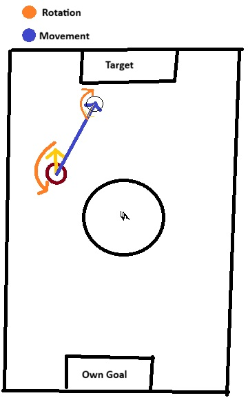
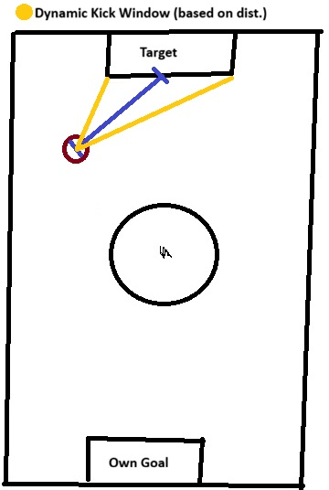
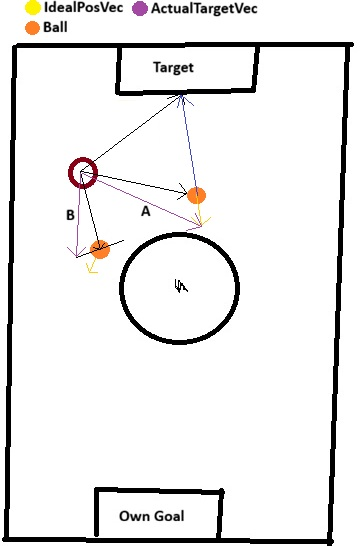

# Strategy

##### Written by Julius Gerhardus
##### (i) = information in appendix

## Line avoidance ( / prevent out of bounds)
For line avoidance we first take the data out of our WorldState(i) from the line sensor
board (https://github.com/bohlebots-pompeii/LineSensor_2026).

##### Drive direction:
Then we take our line vector, normalize the vector, rotate it by 2π (180°) so we drive away from the line. And finally
multiplay it by a constant speed (currently 20 (so 20% of our max speed)).

##### Rotation:
This needs its own section because it's a bit complicated. So normally we cancel any rotation if we hit a line. But in
the special case of the ball being on the line close to the line we rotate towards the ball, so that we can pick it up
using our dribbler.

##### How do we check if the ball is on the line?
This is quite simple: We take our Y Position(i) from our Robot if it is larger than a certain threshold and the ball-Y (
global) is larger than our own (or: Own-Y < -Threashold & Ball-Y < Own-Y), then the ball should be on a line (this only
applies for the sidelines not the pocket's).

## Striker
(sections are ordered in priority used by the action decider. Read it top to bottom)
### Scoring
If the bot has the ball in its dribbler for long enough, we determine between two behaviors (deciding when which of them is triggered is a WIP currently).
First behavior: Hidden Ball Technique. We slowly rotate around our own axis until our back is facing the target goal. Whilst doing that we move towards the target goal.
<br> (Future Consideration: Drive to the line first and then move down the line.)
<br> If we are close enough to the target goal we slowly rotate towards the target goal (clockwise if we are to the left of the target and vise versa).


<br> *Figure 1.1.: Current Hidden Ball Technique*

<br> Second Behavior: Normal Scoring. Just align with the goal and then drive towards it.

<br> Kick Window:
<br> If we are close enough to the target goal, and we are aligned in a specific dynamically computed kick-Window, we initiate a kick using our solenoid.

<br> Kick window calculation: 
<br> We use (half real life goal width (30cm)) / target goal dist (somewhat in cm using our polynomial) then of that we take the atan.
Convert that to degrees (we sometimes work in degrees and sometimes rad not best practice!) and compare it with our current alignment of the goal.
If it is less than the current kick window we can kick.


<br> *Figure 1.2.: Kick Window*

### Getting behind the ball / get ball
If we don't have the ball we try to get the ball. This is currently being done by a rather simple algorithm.
<br> In the future we plan on replacing that with something better.
We first compute a new vector: from ball → goal. Inorder to do that we subtract the goal vec from the ball vec.
Then we calculate our ideal position. That is done by this formular: ```idealRobotVec = BallVec - (BallToGoalVec * BehindBallDist)``` ("()" used for display purposes, not needed) (See Figure 2. Vector A).
To prevent crashing into the ball, we simply do a quick Dot-product check (between the ball vec and the idealRobotVec) (both vectors are normalized). If the DP is >0.6 we check if the cross product between both of them is >0.0 or not.
If the cross >0.0 then we shift our ideal position vector to the perp. of the ballVec with dynamic strength calculation done by some other checks (for more info. look into the code) (See Figure 2. Vector B).

Some special cases:
- If the std::abs(ballRot) (ballRot in deg) is smaller than ~15deg than we drive straight to the ball and align with the ball.
- If the ball is on the line, (see above: How do we know if the ball is on the line?) we just rotate towards it to pick it up.
- (Only applies if both bots are connected & in play(i)) if the X Pos of the bot is smaller than a threshold we terminate motion in X direction and drive back.
This is used to prevent the striker and goalie driving into each other.


<br> *Figure 2.: Get Behind Ball*

### Ball lost
If ball position is temporarily lost we continue driving the last target vector for some threshold of time (future consideration: reconstruct the ball position if the goalie can still see the ball).
After the time has passed we start driving to either the MidPoint of the field or if the bot is playing lonely striker(i) we drive to the middle of the field in front of our own goal.

## Goalie
### General
The Striker is the decider for the role switching logic.
The Striker is always facing our own goal with its back.
We have two preventative logic circuits:
- Ally collision prevention: If we switch roles or something else happens, and we lose our half circle position (see below), we take our own position and the striker's (ally's) position and make sure that if we are getting to close to our ally or driving towards them, we realign our target vector.
- Ball collision prevention going backwards: To prevent own goals, when driving backwards we check the ball angle. If the ball angle is >90.0° we also realign our target vector.

If we lose ball visibility, which happens a lot in 2v2, we try to reconstruct the ball vector from our striker. Using both positions of the robots and the striker's ball vector.
If both robots don't see the ball we don't see the ball :) (future consideration: We're currently building a new AI (instant segmentation). Then we will hopefully be able to somewhat reliably tell the position of the opponent's robots. Then we can just guard the enemy's robots if we don't see ball)

### Ball stationary detection
If the ball doesn't move for a predetermined time, our robot tries to move towards it to give it a little kick or even get it.
We only drive towards the ball for a short time to make sure that we don't open up our position too much.

### Guarding the goal
To guard the goal the bot moves on a half circle in front of our own goal using PID control algorithms for x, y and rotation.
The circle size is predetermined.

### Ball lost
If we can't see or reconstruct the ball's position we simply move to the Y=0 and keep the circle radius away (on X) from our goal.
That is how we build our "Goal Neutral Point".

## Ally Logic
### Recap
We have a Striker: Tries to get the ball and score.
And we have a Goalie: Tries to defend our own goal while staying on a half circle in front of our own goal.

### Priority System / Logic toggle
If one of our robots is not in play(i) anymore, the remaining robot becomes striker (if not already). In addition, the robot switches to the lonely striker mode(i).
The lonely striker automatically disables all ally logic and skips any assumptions that would need a second robot.

### Switching Logic
At any point in the game when both bots are in play(i) the Goalie can decide to initiate a role switch.
A role switch is simply a call to the striker to tell them: "Hey, you are goalie now". Then the goalie becomes striker and vise versa.

Current cases for a role switch:
- If only one bot is alive / running
- If the goalie has the ball

(Normally there would be a case, if the goalie's angle and distance to the ball is smaller than the striker's we would also switch. But because of several reasons regarding sensor inaccuracy, we concluded that it is too instable and didn't use it).

---
## Appendix
**(i) WorldState**:
First step of every loop run: We take everything we can get from our sensors and already computed information. Then we
built a "WorldState-Frame".
That data can't be modified until the next loop run to keep our program deterministic.

**(i) Coordinate System**:
This is a short briefing of our coordinate system:

```
 ----------------------------
/       | Target Goal |      \
|       \-------------/      |
|             ^ x            |
|     A       |              |
|       \     |              |
|         \   |              |
|           \ |              |
|  y < -------|-------- *    |
|             | \            |
|             |   \          |
|             |     \        |
|             |       B      |
|             *              |
|        /----------\        |
\        | Own Goal |        /
 ----------------------------
```
E.g. the point A has an angle of ~45° from our robots perspective.
Point B has an angle of around -135°.

**(i) In play**:
With in play we mean that both bots are actively playing (as striker and goalie).
If one or both robots are out of play e.g. for a penalty. Ally strategy is automatically turned off.
If only one bot is running we switch to lonely striker. See below.

**(i) Lonely striker**:
When only one bot is actively in play (see above) the bot switches to a behavior called "lonely striker".
In that mode the bot drives back to the neutral point in front of its own goal instead of the midpoint of the field.
(further consideration: the bot should dynamically switch between striker and goalie depending on the ball's position).